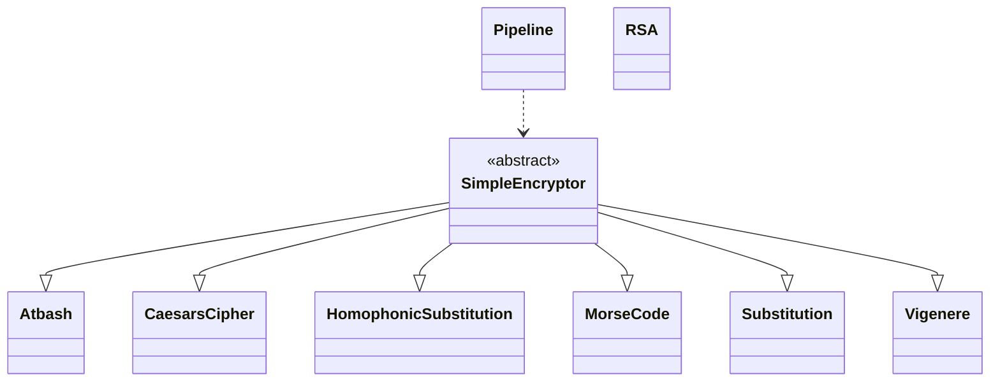

# Docs

Explore the comprehensive documentation offered by **fast-encrypt**, a Python package that offers a variety of cryptographic methods to protect sensitive data simply and effectively.

Whether you are a beginner or an experienced developer, this guide offers **detailed explanations** to make the package easier to understand and use efficiently.

# Table of contents

- [**Class diagram**](#class-diagram)
- [**SimpleEncryptor**](#simpleencryptor)
- [**Atbash**](#atbash)
- [**CaesarsCipher**](#caesarscipher)
- [**HomophonicSubstitution**](#homophonicsubstitution)
- [**MorseCode**](#morsecode)
- [**Substitution**](#substitution)
- [**Vigenere**](#vigenere)
- [**Pipeline**](#pipeline)
- [**RSA**](#rsa)


## Class diagram



This class diagram shows the inheritance and dependency of the classes.

## SimpleEncryptor

Abstract base class for encryptors.

### Methods

#### `@abstractmethod encrypt(text: str) -> str`

Encrypts the input text.

**Parameters**

- text : `str` - The plaintext to be encrypted

**Returns**

- `str` - The encrypted cipher text

#### `@abstractmethod decrypt(cipher_text: str) -> str`

Decrypts the input cipher text.

**Parameters**

- cipher_text : `str` - The plaintext to be decrypted

**Returns**

- `str` - The decrypted plaintext

## Atbash

Class for encrypting and decrypting text using the **Atbash cipher**.

This class inherits from [`SimpleEncryptor`](#simpleencryptor).

The [Atbash cipher](https://en.wikipedia.org/wiki/Atbash) is a basic encryption method dating back to biblical times. It substitutes each letter of the alphabet with its inverse counterpart, such that `"A"` is replaced by `"Z"` and vice versa. While easily reversible and lacking substantial security, it serves well for simple message encoding and decoding purposes.

### Methods

#### `__init__() -> None`

Initializes the `Atbash` cipher.

#### `encrypt(text: str) -> str`

Encrypts the input text using the Atbash cipher.

**Parameters**

- text : `str` - The plaintext to be encrypted

**Returns**

- `str` - The encrypted cipher text

#### `decrypt(cipher_text: str) -> str`

Decrypts the input cipher text into plaintext.

**Parameters**

- cipher_text : `str` - The plaintext to be decrypted

**Returns**

- `str` - The decrypted plaintext

### Examples

Encrypting a text:

```python
>>> from fast_encrypt import Atbash
>>> atbash_cipher = Atbash()
>>> atbash_cipher.encrypt('Hello World!')
"Svool Dliow!"
>>> atbash_cipher.encrypt('Billie Joe Armstrong')
"Yroorv Qlv Zinhgilmt"
```

Decrypting a text:

```python
>>> atbash_cipher = Atbash()
>>> atbash_cipher.decrypt('Svool Dliow!')
"Hello World!"
>>> atbash_cipher.decrypt('Yroorv Qlv Zinhgilmt')
"Billie Joe Armstrong"
```

## CaesarsCipher

Class for encrypting and decrypting text using **Caesar's cipher**.

This class inherits from [`SimpleEncryptor`](#simpleencryptor).

The [**Caesar's cipher**](https://en.wikipedia.org/wiki/Caesar_cipher) is a classic encryption technique attributed to Julius Caesar. It involves shifting each letter of the alphabet by a fixed number of positions. For example, with a shift of 1, `"A"` becomes `"B"` and `"B"` becomes `"C"`, wrapping around the alphabet if necessary. While historically significant, the Caesar's cipher offers minimal security and is easily cracked with modern computational methods.

### Methods

#### `__init__(shift: int) -> None`

Initializes the Caesar's cipher with the given shift.

**Parameters**

- shift : `int` - The shift value for encryption and decryption (must be 0 < shift < 26).

#### `encrypt(text: str) -> str`

Encrypts the input text using the Caesar's cipher.

**Parameters**

- text : `str` - The plaintext to be encrypted

**Returns**

- `str` - The encrypted cipher text

#### `decrypt(cipher_text: str) -> str`

Decrypts the input cipher text into plaintext.

**Parameters**

- cipher_text : `str` - The plaintext to be decrypted

**Returns**

- `str` - The decrypted plaintext

### Examples

Encrypting a text:

```python
>>> from fast_encrypt import CaesarsCipher
>>> caesar_cipher = CaesarsCipher(17)
>>> caesar_cipher.encrypt('Hello World!')
"Yvccf Nficu!"
>>> caesar_cipher.encrypt('David Gilmour')
"Urmzu Xzcdfli"
```

Decrypting a text:

```python
>>> caesar_cipher = CaesarsCipher(17)
>>> caesar_cipher.decrypt('Yvccf Nficu!')
"Hello World!"
>>> caesar_cipher.decrypt('Urmzu Xzcdfli')
"David Gilmour"
```

## HomophonicSubstitution

Class for encrypting and decrypting text using the **Homophonic Substitution cipher**.

This class inherits from [`SimpleEncryptor`](#simpleencryptor).

The [**homophonic substitution**](https://en.wikipedia.org/wiki/Substitution_cipher#Homophonic) cipher replaces each plaintext character with multiple cipher characters to create ambiguity and increase security. This technique, used in cryptographic systems, assigns more than one ciphertext symbol to certain plaintext symbols, making frequency analysis and decryption more challenging.

### Methods

#### `__init__(key: int | str) -> None`

Initializes the Homophonic Substitution cipher with the given key.

**Parameters**

- key : `int | str` - The key for encryption and decryption.

#### `encrypt(text: str) -> str`

Encrypts the input text using the Homophonic Substitution cipher.

**Parameters**

- text : `str` - The plaintext to be encrypted

**Returns**

- `str` - The encrypted cipher text

#### `decrypt(cipher_text: str) -> str`

Decrypts the input cipher text into plaintext.

**Parameters**

- cipher_text : `str` - The plaintext to be decrypted

**Returns**

- `str` - The decrypted plaintext

### Examples

Encrypting a text:

```python
>>> from fast_encrypt import HomophonicSubstitution
>>> homophonic_cipher = HomophonicSubstitution('KEY')
>>> homophonic_cipher.encrypt('Saul Hudson')
```

The result can be:

- `"iEL- ps@i<1"`
- `"kl_% Ms@i<3"`
- `"im_% M_[k:v"`
- `"ilL- M_@kPv"`
- `...`

Decrypting a text:

```python
>>> homophonic_cipher = HomophonicSubstitution('KEY')
>>> homophonic_cipher.decrypt("iEL- ps@i<1")
"SAUL HUDSON"
>>> homophonic_cipher.decrypt("im_% M_[k:v")
"SAUL HUDSON"
```

## MorseCode

Class for encrypting and decrypting text using **Morse code**.

This class inherits from [`SimpleEncryptor`](#simpleencryptor).

The [Morse code](https://en.wikipedia.org/wiki/Morse_code) is a method of encoding text characters as sequences of two different signal durations called dots and dashes. It's widely used for transmitting telegraphic information where long and short signals represent letters and numbers.

### Methods

#### `__init__() -> None`

Initializes the `MorseCode` cipher.

#### `encrypt(text: str) -> str`

Encrypts the input text using Morse code.

**Parameters**

- text : `str` - The plaintext to be encrypted

**Returns**

- `str` - The encrypted cipher text

#### `decrypt(cipher_text: str) -> str`

Decrypts the input cipher text into plaintext.

**Parameters**

- cipher_text : `str` - The plaintext to be decrypted

**Returns**

- `str` - The decrypted plaintext

### Examples

Encrypting a text:

```python
>>> from fast_encrypt import MorseCode
>>> morse = MorseCode()
>>> morse.encrypt('Hello World!')
".... . .-.. .-.. --- .-- --- .-. .-.. -.."
>>> morse.encrypt('Jimi Hendrix')
".--- .. -- .. .... . -. -.. .-. .. -..-"
```

Decrypting a text:

```python
>>> morse.decrypt('.... . .-.. .-.. --- .-- --- .-. .-.. -..')
"HELLOWORLD"
>>> morse.decrypt('.--- .. -- .. .... . -. -.. .-. .. -..-')
"JIMIHENDRIX"
```

## Substitution

Class for encrypting and decrypting text using **Substitution cipher**.

This class inherits from [`SimpleEncryptor`](#simpleencryptor).

The [substitution cipher](https://en.wikipedia.org/wiki/Substitution_cipher) is a basic encryption technique where each plaintext character is replaced by another character based on a fixed system. It operates by substituting one character for another according to a predetermined key. While simple to implement, it's vulnerable to frequency analysis and other cryptographic attacks, making it insufficient for robust security requirements.

### Methods

#### `__init__(key: str) -> None`

Initializes the Substitution cipher with the given key.

**Parameters**

- key : `str` - The substitution key (with 26 no repeated alpha chars).

#### `encrypt(text: str) -> str`

Encrypts the input text using substitution cipher.

**Parameters**

- text : `str` - The plaintext to be encrypted

**Returns**

- `str` - The encrypted cipher text

#### `decrypt(cipher_text: str) -> str`

Decrypts the input cipher text into plaintext.

**Parameters**

- cipher_text : `str` - The plaintext to be decrypted

**Returns**

- `str` - The decrypted plaintext

### Examples

Encrypting a text:

```python
>>> from fast_encrypt import Substitution
>>> substitution_cipher = Substitution('QWERTYUIOPASDFGHJKLZXCVBNM')
>>> substitution_cipher.encrypt('Hello World!')
"Itssg Vgksr!"
>>> substitution_cipher.encrypt('John Frusciante')
"Pgif Ykxleoqfzt"
```

Decrypting a text:

```python
>>> substitution_cipher = Substitution('QWERTYUIOPASDFGHJKLZXCVBNM')
>>> substitution_cipher.decrypt('Itssg Vgksr!')
"Hello World!"
>>> substitution_cipher.decrypt('Pgif Ykxleoqfzt')
"John Frusciante"
```

## Vigenere

Class for encrypting and decrypting text using the **Vigenère cipher**.

This class inherits from [`SimpleEncryptor`](#simpleencryptor).

The [Vigenère cipher](https://en.wikipedia.org/wiki/Vigen%C3%A8re_cipher) is a polyalphabetic substitution cipher that uses a keyword to determine the shift for each letter in the plaintext. It's more secure than simple substitution ciphers because it employs multiple Caesar ciphers in succession. The keyword determines the order of these ciphers and hence the shifting pattern, making it more challenging to decipher without the key. Despite its historical significance, it can be vulnerable to cryptanalysis, especially with shorter keys or known plaintext attacks.

### Methods

#### `__init__(key: str) -> None`

Initializes the Vigenère cipher with the given key.

**Parameters**

- key : `str` - The key for encryption and decryption.

#### `encrypt(text: str) -> str`

Encrypts the input text using Vigenère cipher.

**Parameters**

- text : `str` - The plaintext to be encrypted

**Returns**

- `str` - The encrypted cipher text

#### `decrypt(cipher_text: str) -> str`

Decrypts the input cipher text into plaintext.

**Parameters**

- cipher_text : `str` - The plaintext to be decrypted

**Returns**

- `str` - The decrypted plaintext

### Examples

Encrypting a text:

```python
>>> from fast_encrypt import Vigenere
>>> vigenere_cipher = Vigenere('KEY')
>>> vigenere_cipher.encrypt('Hello World!')
"Rijvs Uyvjn!"
>>> vigenere_cipher.encrypt('Jimmy Page')
"Tmkwc Nkkc"
```

Decrypting a text:

```python
>>> vigenere_cipher = Vigenere('KEY')
>>> vigenere_cipher.decrypt('Rijvs Uyvjn!')
"Hello World!"
>>> vigenere_cipher.decrypt('Tmkwc Nkkc')
"Jimmy Page"
```

## Pipeline

Class for creating a pipeline of encryption and decryption steps.

### Methods

#### `__init__(steps: list[SimpleEncryptor]) -> None`

Initializes the pipeline with the given encryption steps.

**Parameters**

- steps : `list[SimpleEncryptor]` - A list of encryption steps to be applied sequentially.

#### `encrypt(text: str) -> str`

Encrypts the input text using the pipeline of encryption steps.

**Parameters**

- text : `str` - The plaintext to be encrypted

**Returns**

- `str` - The encrypted cipher text

#### `decrypt(cipher_text: str) -> str`

Decrypts the input text using the pipeline of reverse decryption steps.

**Parameters**

- cipher_text : `str` - The plaintext to be decrypted

**Returns**

- `str` - The decrypted plaintext

### Examples

Encrypting a text:

```python
>>> from fast_encrypt import Pipeline, CaesarsCipher, MorseCode, Vigenere
>>> pipeline = Pipeline([CaesarsCipher(3), Vigenere('KEY'), MorseCode()])
>>> pipeline.encrypt('Hello World!')
"..- .-.. -- -.-- ...- -..- -... -.-- -- --.-"
>>> pipeline.encrypt('Josh Klinghoffer')
".-- ...- - ..- .-. -- ...- ..- .... ..- ...- --. ... .-.. ..."
```

Decrypting a text:

```python
>>> pipeline.decrypt('..- .-.. -- -.-- ...- -..- -... -.-- -- --.-')
"HELLOWORLD"
>>> pipeline.decrypt('.-- ...- - ..- .-. -- ...- ..- .... ..- ...- --. ... .-.. ...')
"JOSHKLINGHOFFER"
```

## RSA

Class for implementing the **RSA algorithm** for asymmetric encryption.

[RSA](https://en.wikipedia.org/wiki/RSA_(cryptosystem)) is a public-key encryption algorithm widely used in secure data transmission and digital signatures. It relies on the practical difficulty of factoring the product of two large prime numbers. RSA encryption involves generating a public and private key pair, where the public key is used for encryption and the private key for decryption. This asymmetric cryptography method ensures secure communication over insecure networks, providing confidentiality and authenticity for sensitive information.

### Methods

#### `__init__(key_length: int = 1024) -> None`

Initializes the Vigenère cipher with the given key.

**Parameters**

- key_length : `int` - The RSA key length, by default 1024 (bits qty).

### `generate_keypair() -> tuple[_public_key, _private_key]`

Generates a pair of public and private keys.

**Returns**

- `tuple[_public_key, _private_key]` - A pair of public and private keys

#### `encrypt(public_key: _public_key, text: str) -> str`

Encrypts the text using the specified public key.

**Parameters**

- public_key : `_public_key` - The public key for encryption
- text : `str` - The plaintext to be encrypted

**Returns**

- `str` - The encrypted text

#### `decrypt(cipher_text: str) -> str`

Decrypts the cipher text using the specified private key.

**Parameters**

- private_key : `_private_key` - The private key for decryption
- cipher_text : `str` - The plaintext to be decrypted

**Returns**

- `str` - The decrypted plaintext

### Examples

Encrypting a text:

```python
>>> from fast_encrypt import RSA
>>> rsa = RSA()
>>> public_key, private_key = rsa.generate_keypair()
>>> rsa.encrypt(public_key, 'Hello World!')
```

The result can be:

```python
"7847127900545330234450494651182712418090798037256595068106180662552566637..."
```

> The three dots means the result own more numbers.

Decrypting a text:

```python
>>> rsa.decrypt(
...     private_key,
...     '784712790054533023445049465118271241809079803725659506...'
... )
"Hello World!"
```
